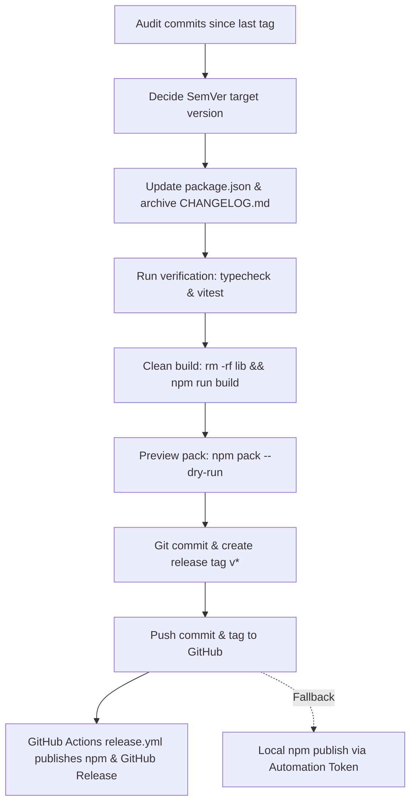

# Plugin Release Procedure & Skill

This skill documents the standard operating procedure (SOP) for releasing versions of `@eddyskywalker/dsh-chatgpt-subscription`. It covers commit auditing, SemVer decisions, CHANGELOG archiving, dual-baseline verification, clean build enforcement, Git tagging, automated CI publishing, and local fallback publishing.

---

## 1. Release Flow Overview



1. **Commit Audit & SemVer**: Compare commits from the last release tag to `HEAD` and determine the version number.
2. **Version & Changelog Sync**:
   - Update `"version"` in `package.json`.
   - In `CHANGELOG.md`, move items under `## Unreleased` into a new `## <version> - YYYY-MM-DD` section, leaving a fresh `## Unreleased` placeholder above it.
3. **Verification & Clean Build**:
   - Run `npm run typecheck` and `npm test`.
   - Wipe `lib/` and rebuild (`rm -rf lib && npm run build`) to ensure no deleted source declarations leak into the bundle.
   - Run `npm pack --dry-run` to preview published files.
4. **Git Commit & Tag**:
   - Commit changes: `git commit -m "chore(release): bump package version to <version>"`.
   - Create annotated/lightweight tag: `git tag v<version>`.
5. **Push & CI Publishing**:
   - Push to GitHub: `git push origin master --tags`.
   - The `.github/workflows/release.yml` workflow triggers on `v*` tags, extracting release notes from `CHANGELOG.md`, publishing to npm via `secrets.NPM_TOKEN`, and creating the GitHub Release.

---

## 2. Step-by-Step Procedure & Commands

### Step 1: Audit Commits & Determine Version

```powershell
# 1. Find the latest release tag
git describe --tags --abbrev=0

# 2. View commits since the last release tag
git log $(git describe --tags --abbrev=0 2>$null || "HEAD~10")..HEAD --oneline
git status

# 3. Choose SemVer increment:
# - Patch (e.g. 0.13.1 -> 0.13.2): Bug fixes, error logging, compatibility tweaks.
# - Minor (e.g. 0.13.1 -> 0.14.0): New features, provider lines, UI redesigns.
# - Prerelease (e.g. 0.13.2-alpha.1): Test builds (must be published with --tag alpha).
```

### Step 2: Update package.json & CHANGELOG.md

1. **Update `package.json`**:
   Change `"version": "x.y.z"` to the new version.

2. **Archive `CHANGELOG.md`**:
   Rename the current `## Unreleased` contents to `## <version> - YYYY-MM-DD`, keeping a fresh `## Unreleased` block at the top:
   ```markdown
   # Changelog

   ## Unreleased

   ## <version> - YYYY-MM-DD

   - **[Line / Feature] Title (#Issue)**
     - Details...
   ```

### Step 3: Verification & Clean Build

As noted in `AGENTS.md`, `lib/` is incremental and keeps declaration files of deleted sources. **Always clean before rebuilding**:

```powershell
# 1. Typecheck
npm run typecheck

# 2. Full test suite
npm test

# 3. Clean build
if (Test-Path lib) { Remove-Item -Recurse -Force lib }
npm run build

# 4. Pack dry-run to verify included files
npm pack --dry-run
```

### Step 4: Git Commit & Tag

```powershell
# 1. Stage release metadata
git add package.json CHANGELOG.md

# 2. Commit with conventional prefix
git commit -m "chore(release): bump package version to <version>"

# 3. Tag with v prefix (must match v* for GitHub Actions)
git tag v<version>
```

### Step 5: Push & CI Automated Release

```powershell
# Optional: Set local proxy if GitHub connection stalls
# $env:all_proxy="http://127.0.0.1:7890"

# Push branch and tags
git push origin master
git push origin v<version>
```

Once pushed, GitHub Actions `.github/workflows/release.yml` will automatically:
1. Validate types and run the test suite.
2. Clean and build production assets.
3. Extract matching release notes from `CHANGELOG.md`.
4. Publish to npm registry using `NPM_TOKEN`.
5. Create a GitHub Release with the extracted notes and upload the `.tgz` tarball.

---

## 3. Automated One-Command Helper

A release helper script is available at `.dsh/skills/release-plugin/scripts/release.mjs`. You can trigger it via npm:

```powershell
# Bump and release a specific version
npm run release 0.13.2
```

This helper automatically handles updating `package.json`, archiving `CHANGELOG.md`, running `typecheck` and `test`, cleaning `lib/`, compiling, committing, and tagging.

---

## 4. Local Fallback Publishing (Bypassing 2FA)

If GitHub Actions is unavailable or immediate publishing is required:

```powershell
# 1. Verify npm identity
npm whoami

# 2. Publish (Automation Token configured in ~/.npmrc bypasses 2FA)
# For stable:
npm publish --access public

# For prereleases:
npm publish --access public --tag alpha
```

---

## 5. Traps & Invariants

1. **`lib/` Stale Files**: Never publish without `rm -rf lib && npm run build`. The build cache does not track deleted source files.
2. **Prerelease Tags**: npm 11+ refuses to publish prereleases without an explicit `--tag <dist-tag>`.
3. **Automation Tokens vs Publish Tokens**: Always use an `Automation` token in `~/.npmrc` and CI secrets; `Publish` tokens require interactive 2FA OTP for write actions.
